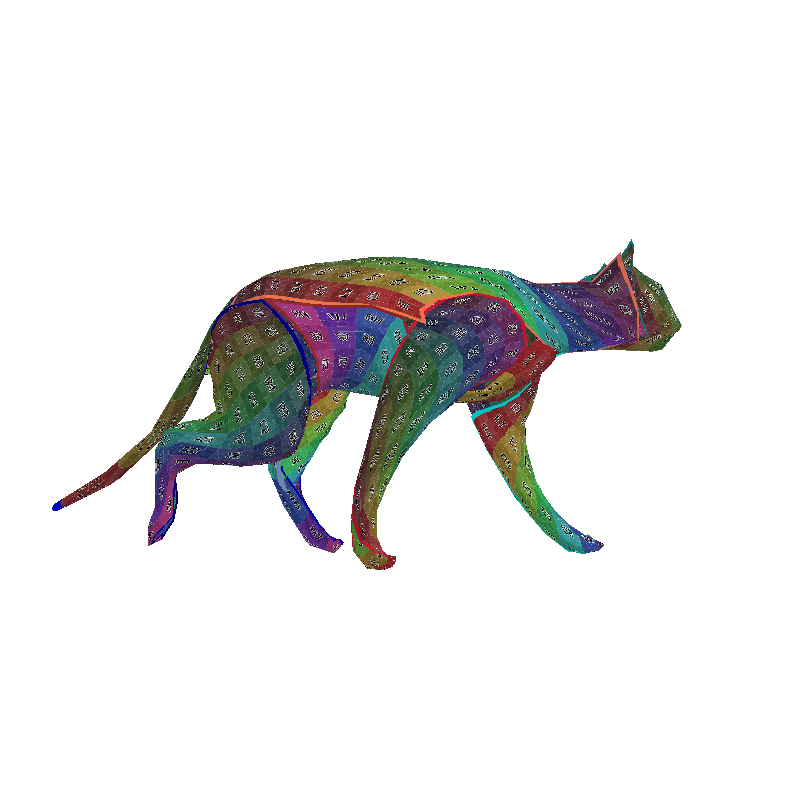

# Temporally-Coherent Surface Reconstruction via Metric-Consistent Atlases [[Paper]](https://arxiv.org/abs/2104.06950) [[Project page]](https://bednarikjan.github.io/projects/temp_cons_surf_rec/) [[Video]](https://youtu.be/P4imXONmtto)

<div float="left">
    
    
</div>
<div float="left">
    
    
</div>

The implementation of the papers 
- [**Temporally-Coherent Surface Reconstruction via Metric-Consistent Atlases**](https://arxiv.org/abs/2104.06950) (ICCV'21) 

  Jan Bednarik, Vladimir G. Kim, Siddhartha Chaudhuri, Shaifali Parashar, Mathieu Salzmann, Pascal Fua, Noam Aigerman


- **Temporally-Consistent Surface Reconstruction using Metrically-Consistent 
Atlases** (under TPAMI review)

  Jan Bednarik, Noam Aigerman, Vladimir G. Kim, Siddhartha Chaudhuri, Shaifali Parashar, Mathieu Salzmann, Pascal Fua

## Install
The framework was tested with Python 3.8, PyTorch 1.7.0. and CUDA 11.0. The 
easiest way to work with the code is to create a new virtual Python environment 
and install the required packages.

1. Install the [virtualenvwrapper](https://virtualenvwrapper.readthedocs.io/en/latest/).
2. Create a new environment and install the required packages.

```shell
mkvirtualenv --python=python3.8 tcsr
pip install -r requirements.txt
```

3. Get the code and prepare the environment as follows:

```shell
git clone git@github.com:bednarikjan/temporally_coherent_surface_reconstruction.git
git submodule update --init --recursive
export PYTHONPATH="{PYTHONPATH}:path/to/dir/temporally_coherent_surface_reconstruction"
```

## Get the Data
The project was tested on 6 base datasets (and their derivatives). Each datasets 
has to be processed so as to generate the input point clouds for training, the 
GT correspondences for evauluation and other auxilliary data. To do so, please 
use the individual scripts in `tcsr/process_datasets`. For each dataset, follow 
these steps:

1. Download the data (links below).
2. Open the script `<dataset_name>.py` and set the input/output paths.
3. Run the script: ```python <dataset_name>.py```

### 1. ANIM
- [Download](http://people.csail.mit.edu/sumner/research/deftransfer/data.html) the sequences `horse gallop`, `horse collapse`, `camel gallop`, `camel collapse`, and `elephant gallop`.
- [Request the access](https://hal.inria.fr/inria-00151606v2) to the sequence `walking cat` and download it.

### 2. AMA
- [Download](https://people.csail.mit.edu/drdaniel/mesh_animation/) all 10 sequences, meshes only.

### 3. DFAUST
- [Download](https://dfaust.is.tue.mpg.de/index.html) the whole datset.

### 4. CAPE
- [Request the access](https://cape.is.tue.mpg.de/) to the raw scans and download it.
- At the time of writing the paper (September 2021) four subjects (`00032`, `00096`, `00159`, `03223`) were available and used in the paper.

### 5. INRIA
- [Request the access](https://hal.inria.fr/hal-01344795v4) to the dataset and download it.
- At the time of writing the paper (September 2021), four subjects (`s1`, `s2`, `s3`, `s6`) were available and used in the paper.

### 6. CMU
- Download [the sequence `171026_pose3`](http://domedb.perception.cs.cmu.edu/171026_pose3.html) using the [PanopticStudio Toolbox](http://domedb.perception.cs.cmu.edu/171026_pose3.html).
- Generate the point clouds from the Kinect recordings using [KinopticStudio Toolbox](https://github.com/CMU-Perceptual-Computing-Lab/panoptic-toolbox/blob/master/README_kinoptic.md) (requires Matlab).

## Train

The provided code allows for training our proposed method (OUR) but also the 
other atlas based approaches [Differential Surface Representation](https://github.com/bednarikjan/differential_surface_representation) 
(DSR) and [AtlasNet](https://github.com/ThibaultGROUEIX/AtlasNet) (AN). 
The training is configured using the `*.yaml` configuration scripts 
in `tcsr/train/configs`.

There are 9 sample configuration files `our_<dataset_name>.yaml` which train 
OUR on each individual dataset and 2 sample configuration files 
`an_anim.yaml`, `dsr_anim.yaml` which train AN and DSR respectivelly on 
ANIM dataset. 

By default, the trainin uses the exact settings as in the paper, namely it 
trains for 200'000 iterations using SGD, learning rate of 0.001 and batch 
size of 4. This can be altered in the configuration files. 

Before starting the training, follow these steps:
- Open the source file `tcsr/data/data_loader.py` and set the paths to the datasets in each dataset class.
- Open the desired training configuration `*.yaml` file in `tcsr/train/configs/` and set the output path for the training run data in the attribute `path_train_run`.

Start the training usint the script `tcsr/train/train.py`:

```shell
python train.py --conf configs/<file_name>.yaml
```

By default the script saves the training progress each 2000 iterations so you 
can safely kill it at any point and resume the trianing later using:

```shell
python train.py --cont path/to/training_run/root_dir
```

## Evaluate

To evaluate a trianed model on the dense correspondence prediction task, use the
script `tcsr/evaluate/eval_dataset.py` which allows for evaluation of multiple
sequences (i.e. individual training runs within one dataset) at once. Please 
have a look at the command line arguments in the file.

An example of how to run the evaluation for the training runs contained in the 
root directory `train_runs_root` corresponding to 2 training runs run for the 
sequences `cat_walk` and `horse_gallop` within ANIM dataset:

```shell
python eval_dataset.py /path/to/train_runs_root --ds anim --include_seqs cat_walk horse_gallop  
```

The script produces a `*.csv` file in `train_runs_root` with the 4 measured metrics (see the paper).

## Visualize

There are currently two ways to visualize the predictions.

### 1. Tensorboard
By default, the training script saves the GT and the  predicted point clouds 
(for a couple of random data samples) each 2000 iterations. These can be viewed 
within Tensorboard. Each patch is visualized with a different color. This 
visualization is mostly useful as a sanity check during the trianing to see 
that the model is converging as expected.

- Navigate to the root directory of the trianing runs and run:
```shell
tensorboard --logdir=. --port=8008 --bind_all
```
- Open your browser and navigate to `http://localhost:8008/`

### 2. Per-sequence reconstruction GIF 
You can view the reconstructed surfaces as a patch-wise textured mesh as a 
video within a GIF file. For this purpose, use the IPython Notebook file 
`tcsr/visualize/render_uv.ipynb` and open it in `jupyterlab` which allows for
viewing the GIF right after running the code. 

The rendering parameters (such as the camera location, texturing mode, 
gif speed etc.) are set usin the configuration file 
`tcsr/visualize/conf_patches.yaml`. There are sample configurations for the 
sequence `cat_walk`, which can be used to write configurations for other
sequences/datasets.

Before running the cells, set the variables in the second cell (paths, models, 
data).

## Citation

 ```
@inproceedings{bednarik2021temporally_coherent,
    title = {Temporally-Coherent Surface Reconstruction via Metric-Consistent Atlases},
    author = {Bednarik, Jan and Kim, Vladimir G. and Chaudhuri, Siddhartha and Parashar, Shaifali and Salzmann, Mathieu and Fua, Pascal and Aigerman, Noam},
    booktitle = {Proceedings of IEEE International Conference on Computer Vision (ICCV)},
    year = {2021}
}
```

## Acknowledgements
This work was partially done while the main author was an intern at Adobe Research.

## TODO
- [ ] Add support for visualizing the correspondence error heatmap on the GT mesh.
- [ ] Add support for visualizing the colorcoded correspondences on the GT mesh.
- [ ] Add the support for generating the pre-aligned AMAa dataset using ICP.
- [ ] Add the code for the nonrigid ICP experiments.
